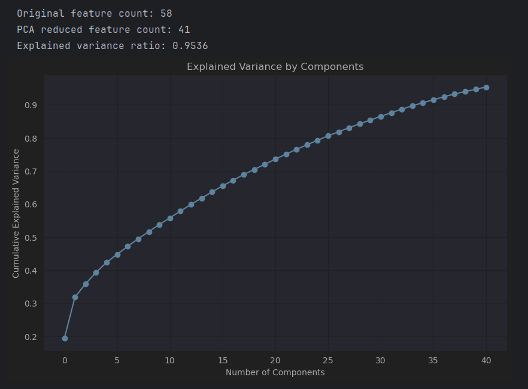

#### [Link to main file](main.ipynb)
#### [Link to equation derivation](Papers/lolaiagentpredict.pdf)

# Hidden Markov Model for League of Legends Match Outcome Prediction

## 1. Introduction

In this milestone, we extend our work from the previous Bayesian Network (BN) approach to a **time-sequence** method using a Hidden Markov Model (HMM). League of Legends matches are inherently time-dependent: a team that is behind early can still come back later through strategic engagements or objective control. Whereas a BN (at a single frame) provides a static snapshot, an HMM captures sequences of frames to model transitions in a team’s advantage over time, thereby offering more nuanced match-outcome predictions.

We used the **Platinum ELO** dataset—thousands of ranked games with 2-minute snapshot intervals—but instead of focusing on a single frame (e.g., minute 10), we considered multiple frames: from minute 10 onward (All Frames), early-only (10–20), and mid-to-late (10–30). Our HMM has hidden states representing whether the team is **Disadvantaged**, **Even**, or **Advantageous**, and we employ the **Viterbi algorithm** to decode the most likely hidden-state path and ultimately predict the match outcome.

---

## 2. PEAS / Agent Analysis

**Performance Measure**
- Accuracy of match outcome prediction. Specifically, we evaluate the predicted “Win” vs. “Lose” label on the test set against ground-truth labels.

**Environment**
- League of Legends game data at Platinum rank, where each match is split into 2-minute intervals from minute 10 onward. Each interval includes gold difference, experience difference, kills, assists, turrets destroyed, and objective control.

**Actuators**
- The HMM outputs a “Win” or “Lose” label for the team at the end of each match.

**Sensors**
- The Riot League of Legends Game API (and the Kaggle dataset) that provides real-time or recorded data for each 2-minute interval.

Our agent is goal-based, focusing on maximizing predictive accuracy for the outcome of a match.

---

## 3. Agent Setup, Data Preprocessing, and Training

### 3.1 Dataset Exploration & Feature Engineering

https://www.kaggle.com/datasets/bobbyscience/league-of-legends-soloq-ranked-games

We used a Kaggle dataset with **\~25,000 matches** at Platinum rank. Each match is subdivided into 2-minute intervals (frames) after the 10-minute mark. We have **55+ features**, including:

- **gold** and **experience** totals,
- **kills**, **assists**, **deaths**,
- **objective control** (Baron, Drake),
- **turrets** destroyed,
- other in-game events.

Our **target variable** is `hasWon` (1 if the BLUE side ultimately wins the match).

To keep the HMM more tractable, we engineered and **discretized** a smaller set of features:

1. `goldDiff` (binary: 1 if gold difference > 0, else 0)
2. `expDiff` (binary: 1 if experience difference > 0, else 0)
3. `kda` (binary: 1 if [kills + (assists // 2) - deaths] > 1, else 0)
4. `wardsDiff` (binary: 1 if wards placed > wards lost, else 0)
5. `drakeDiff` (binary: 1 if drakes taken > drakes lost, else 0)
6. `laneProgression` (binary: 1 if turrets destroyed > turrets lost, else 0)
7. `killedBaronNashor` (binary: 1 if BLUE took Baron, else 0)
8. `lostBaronNashor` (binary: 1 if opposing side took Baron, else 0)
9. `isFirstBlood`
10. `isFirstTower`

### 3.2 Why an HMM?

League of Legends is a **time-evolving** game. Early deficits can be overcome by mid/late-game fights and objective swings. A static model fails to capture these transitions. With an HMM:

- **Hidden States**: We define three advantage states (Disadvantaged, Even, Advantageous).
- **Transitions**: A team can transition from Even → Advantageous or Even → Disadvantaged, etc.
- **Emissions**: Each hidden state is associated with likely values of goldDiff, expDiff, KDA, etc.

The **Viterbi algorithm** finds the most probable sequence of hidden states and thus infers the final advantage state. From this, we predict win/loss.

### 3.3 Parameter Estimation

We estimate **Transition** and **Emission** probabilities from training data:

- **Transition Probability**

  ```math
  P(\text{State}_t \mid \text{State}_{t-1}) \;=\;
  \frac{\text{Count}(\text{State}_{t-1}, \text{State}_t)}
  {\sum_{s'} \text{Count}(\text{State}_{t-1}, s')}
  ```

  For each consecutive pair of frames in each training game, we tally transitions from the previous state to the current state.

- **Emission Probability**

  ```math
  P(\text{Observations}_t \mid \text{State}_t)
  \;\approx\; \prod_{f \in \text{features}} P(f \mid \text{State}_t)
  ```

  Each feature is assumed conditionally independent given the hidden state. We compute the fraction of frames in a given state that have `goldDiff=1`, `expDiff=1`, etc.

We apply Laplace smoothing to handle zero probabilities.

### 3.4 Initial States

We use a simple rule-based approach to label each frame:

- If `goldDiff=1 & expDiff=1 & lostBaronNashor=0` → **Advantageous**
- If `goldDiff=0 & expDiff=0` OR `lostBaronNashor>0` → **Disadvantaged**
- Otherwise → **Even**

This labeling helps define an initial “hidden_state” in the data, which we then refine via the HMM.

### 3.5 Training & Implementation

We split the matches (grouped by `gameId`) into train/test: 75% for training, 25% for testing. We then:

1. **Compute Transition Matrix** from the labeled states of the training set.
2. **Compute Emission Matrix** by aggregating feature occurrences in each state.
3. Use the **Viterbi algorithm** for inference.
4. Determine `P(hasWon | final_state)` by checking how often games with a final hidden state ended in a win.

During test time, we run Viterbi on each sequence of frames to get the final state. We predict a win if `P(win | final_state) > 0.5`.

---

## 4. Training the Model: Key Steps Explained

Below is an **overview** of how our Hidden Markov Model (HMM) is trained and tested, **with small code snippets** illustrating each step.  
We use **four-space indentation** to show code in this single code block without nesting backticks.

---

### 1. Data Splitting

We first split our dataset of **all game sequences** into **75% training** and **25% testing**. Each “sequence” corresponds to one match (a DataFrame of frames sorted by time).

```python
train_sequences, test_sequences = train_test_split(all_sequences, 
                                                    test_size=0.25, 
                                                    random_state=42)
```

- `all_sequences`: a list/iterable where each element is a DataFrame containing all frames for a single match, sorted by time.
- We fix `random_state=42` for reproducibility.

---

### 2. Transition Matrix

Each game’s frames have a **hidden_state** label (e.g., “Even,” “Disadvantaged,” “Advantageous”). We count how often we move from one state to another across consecutive frames, then **normalize** these counts to obtain probabilities.

```python
transition_matrix = np.zeros((n_states, n_states))

for game in train_sequences:
    states_seq = game['hidden_state'].values
    for prev, curr in zip(states_seq[:-1], states_seq[1:]):
        transition_matrix[state_map[prev], state_map[curr]] += 1

# Normalize row-wise to get probabilities, adding small constant to avoid zero
transition_probs = (transition_matrix + 1e-6) / (
    transition_matrix.sum(axis=1, keepdims=True) + 1e-6 * n_states
)
```

- **`state_map`**: A dictionary that maps string states (“Even,” etc.) to integer indices (e.g., 0,1,2).
- **Laplace smoothing** is done via the `1e-6` offset.

---

### 3. Emission Matrix

For each hidden state, we gather all frames in the training set labeled as that state. We then take the **mean** of each observed feature to estimate how likely each feature is to be **1** in that state.

```python
emission_matrix = np.zeros((n_states, len(observed_features)))

for state in hidden_states:
    frames_in_state = pd.concat(train_sequences)[
        pd.concat(train_sequences)['hidden_state'] == state
    ][observed_features]
    if not frames_in_state.empty:
        emission_matrix[state_map[state], :] = frames_in_state.mean().values
```

- Each row of `emission_matrix` corresponds to a hidden state, and each column to an observed feature (like `goldDiff`, `expDiff`, etc.).
- Because these features are binary, taking their mean approximates \(P(\text{feature} = 1 \mid \text{hidden_state})\).

---

### 4. Convert to Log Probabilities

To avoid numerical underflow when multiplying many probabilities, we convert both transition and emission probabilities to **log-space**:

```python
transition_log = np.log(transition_probs)
emission_log = np.log(emission_matrix + 1e-6)
```

Now, multiplying probabilities becomes **adding** log probabilities, which is numerically safer for long sequences.

---

### 5. Viterbi Algorithm

The **Viterbi algorithm** decodes the most likely hidden state path given a sequence of observations.

```python
def viterbi(observations, trans_log, emis_log, start_probs):
    T = len(observations)
    N = len(hidden_states)
    V = np.zeros((T, N))
    backpointer = np.zeros((T, N), dtype=int)
    
    # 1) Initialization
    obs_0 = observations[0]
    for s in range(N):
        V[0, s] = np.log(start_probs[s]) + np.sum(obs_0 * emis_log[s])
    
    # 2) Recursion
    for t in range(1, T):
        obs_t = observations[t]
        for s in range(N):
            prob = V[t-1] + trans_log[:, s]
            best_prev = np.argmax(prob)
            V[t, s] = prob[best_prev] + np.sum(obs_t * emis_log[s])
            backpointer[t, s] = best_prev
    
    # 3) Termination & Backtrack
    best_final_state = np.argmax(V[T-1])
    best_path = [best_final_state]
    for t in range(T-1, 0, -1):
        best_path.insert(0, backpointer[t, best_path[0]])
    
    return [hidden_states[i] for i in best_path]
```

- **Initialization**: Combine the log of the start probability (e.g., `[1/3, 1/3, 1/3]`) with the emission log-likelihood for the first frame.
- **Recursion**: For each time `t`, we compute the maximum over all possible previous states plus the transition log from that previous state. We then add the emission log for the current observation.
- **Backpointers**: We store which previous state led to the maximum probability, so we can reconstruct the path at the end.
- **Termination**: The best final state is the argmax of `V[T-1]`, and we backtrack to get the full state sequence.

---

### 6. Win Probabilities per Final State

We now run Viterbi on **every training sequence** and note the final state. If that game is ultimately a **Win**, we increment a “win” count for that final state; otherwise, a “lose” count.

```python
final_state_counts = {s: {'win': 0, 'lose': 0} for s in hidden_states}

for game in train_sequences:
    obs = game[observed_features].values
    path = viterbi(obs, transition_log, emission_log, start_probs=[1/3,1/3,1/3])
    final_state = path[-1]
    if game['hasWon'].iloc[-1] == 1:
        final_state_counts[final_state]['win'] += 1
    else:
        final_state_counts[final_state]['lose'] += 1

win_probs = {}
for s in hidden_states:
    wins = final_state_counts[s]['win']
    total = wins + final_state_counts[s]['lose']
    win_probs[s] = wins / (total + 1e-6)
```

- After this step, `win_probs[s]` becomes the probability of winning given that the match’s final hidden state is `s`.

---

### 7. Test & Accuracy

Finally, we run **Viterbi** on each test sequence, determine the final state, and predict a **Win** if `win_probs[final_state] > 0.5`.

```python
predictions = []
truth = []

for game in test_sequences:
    obs = game[observed_features].values
    path = viterbi(obs, transition_log, emission_log, start_probs=[1/3,1/3,1/3])
    final_state = path[-1]
    predicted_win = 1 if win_probs[final_state] > 0.5 else 0
    predictions.append(predicted_win)
    truth.append(game['hasWon'].iloc[-1])

accuracy = np.mean(np.array(predictions) == np.array(truth))
print("Test Accuracy:", accuracy * 100, "%")
```

- We compare these predictions against the real `hasWon` values to compute **accuracy**.

---

### Summary

1. **Train/Test Split**: We keep 75% of sequences for parameter estimation and 25% for final evaluation.
2. **Transition & Emission**: We count state transitions and compute feature means per state to form probability matrices.
3. **Viterbi Inference**: We decode the most likely state sequence, focusing on the final state.
4. **Win Probability per Final State**: We tally how often each final state corresponds to a win in the training set.
5. **Test**: Predict outcome based on the final state’s `win_probs`, then evaluate accuracy.

This approach leverages the **temporal structure** of League of Legends matches, often outperforming a purely static (snapshot-based) model.


## 5. Conclusion & Results

We tested our HMM with **three different frame ranges**:

- **All Frames (≥ 10)**
  - **Accuracy**: 79.56%
  - **Final states distribution**: ~3464 “Advantageous,” ~2764 “Disadvantaged” in test set.
  - **Confusion matrix yields**:
    - TP = 2701, FP = 763, FN = 510, TN = 2254
  - **Interpretation**: Using the entire timeline (minute 10 to end) captures early leads, mid-game swings, and late comebacks.
  - 

- **Frames 10–20 (Early Game)**
  - **Accuracy**: 57.72%
  - The model heavily overpredicts “Advantageous” states (many false positives). Early leads often fail to guarantee a final win if the game swings later.
  - 

- **Frames 10–30 (Mid-to-Late Game)**
  - **Accuracy**: 78.23%
  - More balanced than the 10–20 range, yet still slightly below using all frames, reflecting that some late-game actions after minute 30 remain unaccounted for.
  - 

### Comparison with BN (Bayesian Network)

Our previous BN at minute 10 achieved about **70%** accuracy. The HMM with full frame usage improves this to **79.56%**, indicating that **temporal information** indeed helps.

### Limitations & Future Work

1. **Even State**
  - Our initial labeling procedure and the discrete nature of the data lead to fewer “Even” states. Tuning transitions or splitting the states more finely (e.g., 4 or 5 states) might improve modeling.

2. **Beyond 30 Minutes**
  - We can analyze frames up to minute 40–50 to see if capturing endgame pushes further boosts accuracy.

3. **Threshold Tuning**
  - We use a 0.5 threshold for final-state win probability. Different thresholds (e.g., 0.6) might reduce false positives, especially in early/mid-game scenarios.

4. **Feature Engineering**
  - Our discretization may lose detailed information (e.g., a 2k gold lead vs. a 10k gold lead are both “goldDiff = 1”). Intermediate buckets or partial continuous features might improve performance.

5. **Extended States or Semi-Markov**
  - Some events (like major team fights) can drastically swing the game in under a minute, but we only have data every 2 minutes. A more nuanced approach might capture sub-frame transitions.

Despite these limitations, the HMM approach demonstrates that modeling the temporal sequence of game states outperforms a purely static snapshot. In future milestones, we will explore refining hidden states, adding further relevant features, and potentially testing advanced HMM variants.


## Extra material: Comparison to Other Types of Models

In addition to our Hidden Markov Model (HMM) approach, we experimented with several alternative machine learning models to gauge how they perform on the same League of Legends dataset:

1. **Advanced Neural Network (PyTorch)**
  - We built a multi-layer feedforward network with dropout, batch normalization, and a reasonably large hidden dimension. Training was done with Adam/AdamW optimizers, plus optional early stopping.
  - Also implemented PCA to minimize overfitting to our ability.
  - 
  - **Result**: Achieved around **80%** test accuracy in our experiments (see `Neural Network (GPU?)` = 0.8008 in the comparison snippet).
  - 
  - 


2. **XGBoost (GPU)**
  - We leveraged `xgboost`’s GPU-accelerated training using the `gpu_hist` tree method. We trained incrementally for 100 boosting rounds with a logistic objective.
  - **Result**: Achieved around **83.40%** accuracy (`0.8340`) on the test set.

3. **Random Forest (CPU, scikit-learn)**
  - Used an incremental approach to train a scikit-learn `RandomForestClassifier`, adding trees one by one and monitoring progress with a progress bar.
  - **Result**: Achieved the best performance among these three methods, around **83.74%** accuracy (`0.8374`).

Below is the final comparison:

- XGBoost (GPU): 0.8340
- Random Forest (CPU): 0.8374
- Neural Network (GPU?): 0.8008
- Bayesian: 0.71
- HMM: 0.80


### Observations & Insights

- **Neural Networks** proved more sensitive to hyperparameters, data preprocessing, and training stability. While they can exceed the performance of simpler models in some tasks, they often require extensive tuning (learning rates, architecture depth, regularization) and more training data.
- **XGBoost** remains popular for tabular data. It converges relatively quickly and handles many real-world datasets well.
- **Random Forest** is easy to implement, robust to overfitting, and consistently performs well with minimal tuning in many classification tasks—particularly those with a mix of numerical and categorical features.

Comparing these to our **HMM** approach:
- The HMM excels at modeling **temporal sequences**, capturing how advantage states change over time in a League of Legends match. This makes it very **domain-specific** and valuable if we aim to interpret game states at various time frames.
- Models like Random Forest or XGBoost generally treat each match or each frame **independently**, without explicit time-series state transitions.
- For a purely **classification** perspective (predicting final game outcome from a set of static features), **Random Forest** or **XGBoost** can yield high accuracy.
- However, if we want a **dynamic, time-step-by-time-step** analysis—e.g., “What is the probability of a comeback if a team is behind by X gold at minute 25?”—the HMM’s state-based approach is far more interpretable and suited to the sequential nature of the problem.

In summary, different models excel at different aspects:
- **HMM** for sequence-based interpretation and stepwise advantage transitions.
- **Random Forest/XGBoost** for static snapshots and high baseline accuracy.
- **Neural Networks** for deeper, potentially non-linear representations, though typically requiring more careful hyperparameter tuning and larger data volumes.

Thus, depending on whether the goal is maximum purely static accuracy or a time-evolving perspective, the best choice may differ.

## Group Members
- Jason Cheung, jac130@ucsd.edu
- Jeremy Lim, jel125@ucsd.edu
- Kevin Zheng, kezheng@ucsd.edu
- Daniil Katulevskiy, dkatulevskiy@ucsd.edu
- Petra Hu, e2hu@ucsd.edu

## Figures

All the data processing steps from Milestone 2 are still relevant for our new HMM model. Figures are presented below, but in-depth explanation of previous data exploration can be found below in an expandable Milestone 2 readme.


<details>
  <summary>Click to expand for older version</summary>

# AI Agent for League of Legends Match Prediction Using Bayesian Network

## Abstract
This AI agent is designed to predict match outcomes in League of Legends based on in-game statistics. Using a dataset containing high-ranked matches with detailed in-game metrics—such as minion kills, gold earned, experience gained, jungle control, and objective captures—the agent analyzes early-game conditions and predicts whether a team will win or lose. The performance measure of the agent is the accuracy of match predicting outcomes, whereas the environment is the stats of League of Legends Platinum Ranked Games (starting with minute 10 with strides of 2 minutes). Actuators are displaying match prediction output and Sensors are the Riot League of Legends Game API. The agent operates as a goal-based AI, focusing solely on maximizing the accuracy of its match outcome predictions. Given the strong conditional dependencies among in-game variables (e.g., minion kills correlating with gold and experience leads) along with the binary nature of predictions makes probabilistic agents such as Bayesian networks a good fit.


## AI Agent Type
The AI agent used in this model is a goal-based agent, meaning it operates by assessing game state information and attempting to maximize its ability to predict the winning team. The prediction is probabilistic, leveraging a Bayesian Network structure to infer likely outcomes based on early-game conditions.

## AI Agent Setup and Probabilistic Modeling
The Bayesian network is structured to capture key dependencies between game metrics, such as gold difference, experience difference, kills, deaths, and objective control. The structure is learned using a Hill Climbing Search algorithm with a Bayesian Information Criterion (BIC) Score to find the best-fitting network structure.

## Hill Climbing Search for Bayesian Network Structure Learning

To determine the optimal structure of the Bayesian network, we employed the Hill Climbing Search algorithm. This algorithm iteratively explores possible modifications to the network structure, evaluating each modification using the Bayesian Information Criterion (BIC) score to determine the most likely structure given the data. The process involves:

- Initialization: Start with an initial network structure (e.g., an empty graph or a naïve Bayes structure).

- Iterative Improvement:

  - Add, remove, or reverse an edge between nodes.

  - Calculate the BIC score for the new structure.

  - Accept the modification if it improves the score.

- Termination: The algorithm stops when no further modifications improve the score.

This approach allows us to efficiently learn a probabilistic graphical model that best represents the relationships between game features while avoiding overfitting.

## Conditional Probability Table (CPT) Estimation

The Conditional Probability Tables (CPTs) are estimated based on frequency counts from the dataset. Given a parent node  and a child node , the conditional probability of  given  is calculated as:

- $P(C|P) = \frac{count(C, P)}{count(P)}$
  where:

count(C, P) is the number of occurrences where both  and  appear together in the dataset.

count(P) is the total occurrences of  in the dataset.

More detailed derivation is in [Link to equation derivation](Papers/lolaiagentpredict.pdf)

## Datasets

These are the potential datasets for training and evaluating our AI model. The top-ranked (1st) dataset is preferred, while the others are alternative options:

1. https://www.kaggle.com/datasets/bobbyscience/league-of-legends-soloq-ranked-games

This dataset contains the stats of approximately 25000 ranked games (SOLO QUEUE) from a Platinium ELO. Each game is unique. The gameId can help you to fetch more attributes from the Riot API. Each game has features from different time frames from 10min to the end of the game. For example, game1 10min, game1 12min, game1 14min etc. In total there are +240000 game frames. There are 55 features collected for the BLUE team. This includes kills, deaths, gold, experience, level. It's up to you to do some feature engineering to get more insights. The column hasWon is the target value if you're doing classification to predict the game outcome. Otherwise you can use the gameDuration attribute if you wanna predict the game duration. Attributes starting with is* are boolean categorial values (0 or 1).

2. https://www.kaggle.com/datasets/bobbyscience/league-of-legends-diamond-ranked-games-10-min/data

This dataset contains the first 10min. stats of approx. 10k ranked games (SOLO QUEUE) from a high ELO (DIAMOND I to MASTER). Players have roughly the same level. Each game is unique. The gameId can help you to fetch more attributes from the Riot API. There are 19 features per team (38 in total) collected after 10min in-game. This includes kills, deaths, gold, experience, level… It's up to you to do some feature engineering to get more insights. The column blueWins is the target value (the value we are trying to predict). A value of 1 means the blue team has won. 0 otherwise.

3. https://www.kaggle.com/datasets/jakubkrasuski/league-of-legends-match-dataset-2025

This dataset haven 94 attributes capturing comprehensive match and player data.
Key columns: game_id, game_start_utc, game_duration, queue_id, participant_id, kills, deaths, assists, final_damageDealt, final_goldEarned, and more.

## Training the First Model
The first version of the model was trained using:
- A dataset filtered at the 10-minute mark to capture early-game statistics.
  - Split 75-25 into training and test.
- Conditional probabilities of a relevant Bayesian network were estimated using training set.

The Bayesian network was determined using:
- Bayesian network structure learning via Hill Climb Search.
- Data count and distribution analysis filtering features with too little data.
- Correlation analysis with heatmaps and pairplots showing feature dependence.
- Domain knowledge from wikis and personal experience

## Model Evaluation
- Accuracy Assessment: Comparing predictions against actual game results within the test set.

## PEAS Analysis
- Performance Measure: Accuracy of match prediction.
- Environment: In-game statistics from League of Legends Platinum Ranked Games.
- Actuators: Model predictions displayed in outputs.
- Sensors: Riot League of Legends Game API providing real-time data.

## Conclusion

The first iteration of our Bayesian network model has provided promising insights into early-game win prediction. Key takeaways include:
### Milestone 2 Conclusion
Model evaluation
- Our initial model is fairly successful, reaching around 71% accuracy.
- Precision and recall are similar, as expected of a 50/50 dataset
- However, it seems difficult to improve merely through considering more inputs.
- Conditioning off goldDiff or expDiff alone already hits around 70% accuracy (17846 / 24912 for gold, 17581 / 24912 for exp)

Potential model improvements:
- Finer state splits (ex. more than boolean states)
- More data for rarer state combinations (small effect on accuracy but large effect on usefulness)
  - goldDiff > 0 and expDiff < 0 occurred in 2083 / 24912 cases
  - goldDiff < 0 and expDiff > 0 occurred in 1808 / 24912 cases
  - Significant obstacle to adding more state splits
- Add KDR weighting.
  - Due to low respawn times in the early game, champion kills should be more or less conditionally independent to winning outside given their effect on gold and exp. However, due to being affected by player/team skill, they are still relevant conditions by proxy. This is shown in the strong correlations of the kills and deaths in the first 10 minutes to winning.
- Add Drake weighting
  - Mostly due to above reason above, but killing drakes gives slight boosts and prevents the other team from killing a drake for its 5 minute respawn timer.

Markov Chain:
- Because the dataset includes information at 2 minute intervals, we could increase the functionality of the model by converting it to a time based markov chain which attempts to predict how many objective buildings (turrets, inhibitors, nexus) get destroyed in the next 2 minutes based on the change of stats between frames. However, due to the amount of feedback loops, it likely won't be more accurate.

  Challenges:
- Time based weighting (stats like respawn time change and using absolute values for gold work less well)
- Coarse information (only a snapshot every 2 minutes)
- Independence between lanes
- Intrinsic loops with gold and experience
- Generally high complexity


A more realistic objective could be predicting the chance of a win / loss in the next 6 minutes

Hiding information
- Notably, one of the advantages of Bayesian networks, the ability to generate a CPT, is unused in our current agent as the only piece of information we have available in training but not in testing is the end result of a match.
- We could create a slightly different agent which functions based on the information given to a certain team rather than the information available to spectators (ex. certain info such as the enemy team's gold is not present).

## CPTs


## Figures


## Group Members
- Jason Cheung, jac130@ucsd.edu
- Jeremy Lim, jel125@ucsd.edu
- Kevin Zheng, kezheng@ucsd.edu
- Daniil Katulevskiy, dkatulevskiy@ucsd.edu
- Petra Hu, e2hu@ucsd.edu
</details>