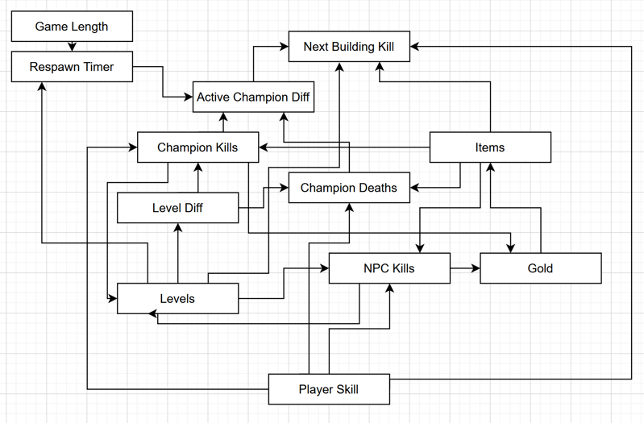

#### [Link to main file](main.ipynb)
#### [Link to equation derivation](Papers/lolaiagentpredict.pdf)

# AI Agent for League of Legends Match Prediction Using Bayesian Network

## Abstract
This AI agent is designed to predict match outcomes in League of Legends based on in-game statistics. Using a dataset containing high-ranked matches with detailed in-game metrics—such as minion kills, gold earned, experience gained, jungle control, and objective captures—the agent analyzes early-game conditions and predicts whether a team will win or lose. The performance measure of the agent is the accuracy of match predicting outcomes, whereas the environment is the stats of League of Legends Platinum Ranked Games (starting with minute 10 with strides of 2 minutes). Actuators are displaying match prediction output and Sensors are the Riot League of Legends Game API. The agent operates as a goal-based AI, focusing solely on maximizing the accuracy of its match outcome predictions. Given the strong conditional dependencies among in-game variables (e.g., minion kills correlating with gold and experience leads) along with the binary nature of predictions makes probabilistic agents such as Bayesian networks a good fit.

## AI Agent Type
The AI agent used in this model is a goal-based agent, meaning it operates by assessing game state information and attempting to maximize its ability to predict the winning team. The prediction is probabilistic, leveraging a Bayesian Network structure to infer likely outcomes based on early-game conditions.

## AI Agent Setup and Probabilistic Modeling
The Bayesian network is structured to capture key dependencies between game metrics, such as gold difference, experience difference, kills, deaths, and objective control. The structure is learned using a Hill Climbing Search algorithm with a Bayesian Information Criterion (BIC) Score to find the best-fitting network structure.

## Datasets

Please provide links to your proposed datasets below. You can submit up to 3, but only need 1. The top one will ranked 1st and the bottom ranked last:

1. https://www.kaggle.com/datasets/bobbyscience/league-of-legends-soloq-ranked-games

This dataset contains stats of approx. 25000 ranked games (SOLO QUEUE) from a Platinium ELO. Each game is unique. The gameId can help you to fetch more attributes from the Riot API. Each game has features from different time frames from 10min to the end of the game. For example, game1 10min, game1 12min, game1 14min etc. In total there are +240000 game frames. There are 55 features collected for the BLUE team. This includes kills, deaths, gold, experience, level… It's up to you to do some feature engineering to get more insights. The column hasWon is the target value if you're doing classification to predict the game outcome. Otherwise you can use the gameDuration attribute if you wanna predict the game duration. Attributes starting with is* are boolean categorial values (0 or 1).

2. https://www.kaggle.com/datasets/bobbyscience/league-of-legends-diamond-ranked-games-10-min/data

This dataset contains the first 10min. stats of approx. 10k ranked games (SOLO QUEUE) from a high ELO (DIAMOND I to MASTER). Players have roughly the same level. Each game is unique. The gameId can help you to fetch more attributes from the Riot API. There are 19 features per team (38 in total) collected after 10min in-game. This includes kills, deaths, gold, experience, level… It's up to you to do some feature engineering to get more insights. The column blueWins is the target value (the value we are trying to predict). A value of 1 means the blue team has won. 0 otherwise.

3. https://www.kaggle.com/datasets/jakubkrasuski/league-of-legends-match-dataset-2025

This dataset haven 94 attributes capturing comprehensive match and player data. 
Key columns: game_id, game_start_utc, game_duration, queue_id, participant_id, kills, deaths, assists, final_damageDealt, final_goldEarned, and more.

## Training the First Model
The first version of the model was trained using:
- A dataset filtered at the 10-minute mark to capture early-game statistics.
    - Split 75-25 into training and test.
- Conditional probabilities of a relevant Bayesian network were estimated using training set.

The Bayesian network was determined using:
- Bayesian network structure learning via Hill Climb Search.
- Data count and distribution analysis filtering features with too little data.
- Correlation analysis with heatmaps and pairplots showing feature dependence.
- Domain knowledge from wikis and personal experience

## Model Evaluation
- Accuracy Assessment: Comparing predictions against actual game results within the test set.

## PEAS Analysis
- Performance Measure: Accuracy of match prediction.
- Environment: In-game statistics from League of Legends Platinum Ranked Games.
- Actuators: Model predictions displayed in outputs.
- Sensors: Riot League of Legends Game API providing real-time data.

## Conclusion

The first iteration of our Bayesian network model has provided promising insights into early-game win prediction. Key takeaways include:
### Milestone 2 Conclusion
Model evaluation
- Our initial model is fairly successful, reaching around 71% accuracy.
- Precision and recall are similar, as expected of a 50/50 dataset
- However, it seems difficult to improve merely through considering more inputs.
 - Conditioning off goldDiff or expDiff alone already hits around 70% accuracy (17846 / 24912 for gold, 17581 / 24912 for exp)

Potential model improvements:
- Finer state splits (ex. more than boolean states)
- More data for rarer state combinations (small effect on accuracy but large effect on usefulness)
  - goldDiff > 0 and expDiff < 0 occurred in 2083 / 24912 cases
  - goldDiff < 0 and expDiff > 0 occurred in 1808 / 24912 cases
  - Significant obstacle to adding more state splits
- Add KDR weighting.
  - Due to low respawn times in the early game, champion kills should be more or less conditionally independent to winning outside given their effect on gold and exp. However, due to being affected by player/team skill, they are still relevant conditions by proxy. This is shown in the strong correlations of the kills and deaths in the first 10 minutes to winning.
- Add Drake weighting
  - Mostly due to above reason above, but killing drakes gives slight boosts and prevents the other team from killing a drake for its 5 minute respawn timer.

Markov Chain:
- Because the dataset includes information at 2 minute intervals, we could increase the functionality of the model by converting it to a time based markov chain which attempts to predict how many objective buildings (turrets, inhibitors, nexus) get destroyed in the next 2 minutes based on the change of stats between frames. However, due to the amount of feedback loops, it likely won't be more accurate.

   Challenges:
- Time based weighting (stats like respawn time change and using absolute values for gold work less well)
- Coarse information (only a snapshot every 2 minutes)
- Independence between lanes 
- Intrinsic loops with gold and experience
- Generally high complexity

A more realistic objective could be predicting the chance of a win / loss in the next 6 minutes

Hiding information
- Notably, one of the advantages of Bayesian networks, the ability to generate a CPT, is unused in our current agent as the only piece of information we have available in training but not in testing is the end result of a match.
- We could create a slightly different agent which functions based on the information given to a certain team rather than the information available to spectators (ex. certain info such as the enemy team's gold is not present).

## Group Members
- Jason Cheung, jac130@ucsd.edu
- Jeremy Lim, jel125@ucsd.edu 
- Kevin Zheng, kezheng@ucsd.edu 
- Daniil Katulevskiy, dkatulevskiy@ucsd.edu 
- Petra Hu, e2hu@ucsd.edu 
